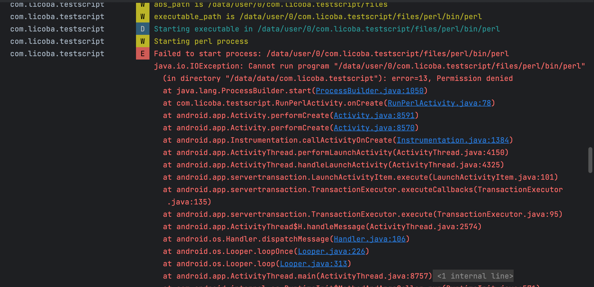

## Android执行Perl

> Try to run perl scripts in Android Application
--
在执行本项目时碰到的错误：

```log
   com.licoba.testscript        W  Starting perl process
   com.licoba.testscript        E  Failed to start process: /data/user/0/com.licoba.testscript/files/perl/bin/perl
                                                                  java.io.IOException: Cannot run program "/data/user/0/com.licoba.testscript/files/perl/bin/perl" (in directory "/data/data/com.licoba.testscript"): error=13, Permission denied
```



是因为  ProcessBuilder  从Android 10 开始，就没办法执行Android私有目录下的任何文件了
可以参考这个 https://stackoverflow.com/questions/60370424/permission-is-denied-using-android-q-ffmpeg-error-13-permission-denied


至于解决方案，在这里 https://stackoverflow.com/questions/60370424/permission-is-denied-using-android-q-ffmpeg-error-13-permission-denied


---
【感谢】
- 原项目在这里：https://github.com/castaway/run-perl  是一个十年前的项目，在Android App里面可以运行可执行的二进制文件。